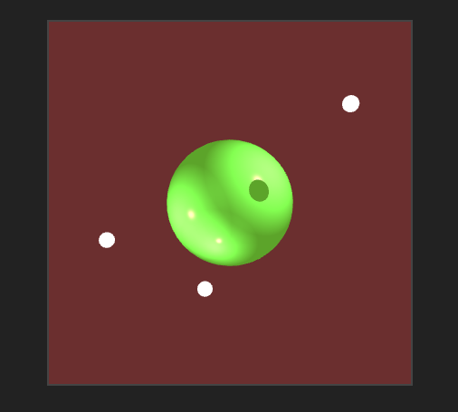
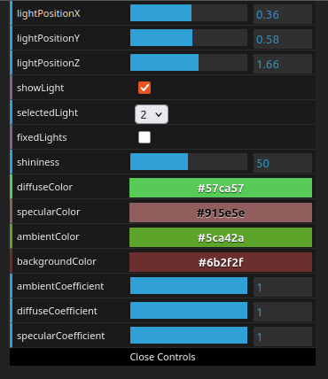

# Iluminación en WebGL



En este proyecto se renderiza, utilizando ```WebGL```, una esfera iluminada por diferentes luces representadas como esferas de color blanco. Estas luces, presentes hasta un máximo de 5, pueden ser modificadas de distintas formas para observar como afecta a la esfera.

## Acceso a la versión web

La versión web de este proyecto se encuentra en [este sandbox de codesandbox](https://4yfx4w.csb.app/).

El código se puede acceder desde [este enlace](https://codesandbox.io/p/sandbox/webgl-practica-5-4yfx4w).

## Ejecución del proyecto en local

A continuación, se detallan las instrucciones de ejecución del proyecto de forma local en caso de que la version web fallara.

1. Descargar o clonar el repositorio

2. Descargar e instalar la version mas reciente de ``Node.js`` desde [este enlace](https://nodejs.org/en)

3. Para asegurar que la instalación se realizó correctamente utilizar los siguientes comandos en un terminal o símbolo del sistema:

```
node --version
npm --version
```

4. Una vez correctamente instalado ejecutar el siguiente comando desde un terminal o símbolo del sistema en el directorio o carpeta en el que se encuentre el proyecto:

```
npm install
```

5. Una vez termine el comando anterior ejecutar el siguiente comando desde el mismo terminal o simbolo del sístema:

```
npm run start
```

6. Una vez ejecutado este comando se observará en la consola algo parecido a esto:
```
> webgl_p5@1.0.0 start
> parcel ./src/index.html

Server running at http://localhost:1234
```

7. Abrir un navegador y, en la barra de direcciones, escribir ```localhost:1234```

8. Para terminar la simulación, pulsar la combinación de botones ```Ctrl + C``` en la consola donde se realizó el paso 5

## Controles de la simulación

### Control de la cámara

La cámara de la simulación puede ser controlada con el ratón pulsando el botón izquierdo y arrastrando. El zoom puede ser controlado con la rueda del ratón.

### Control de la simulación

Algunos parámetros de la simulación pueden ser controlados con la interfaz de usuario presente en la simulación. En esta interfaz de usuario se puede modificar la posición y la visibilidad de las luces presentes en la simulación.

También es posible modificar otros parámetros comunes a todas las luces.



A continuación se explican los controles que se encuentran en esta interfaz:

1. ```lightPositionX```: Control de posición en el eje X de la luz seleccionada. Permite seleccionar un valor entre -10.0 y 10.0.
2. ```lightPositionY```: Control de posición en el eje Y de la luz seleccionada. Permite seleccionar un valor entre -10.0 y 10.0.
3. ```lightPositionZ```: Control de posición en el eje Z de la luz seleccionada. Permite seleccionar un valor entre -10.0 y 10.0.
4. ```showLight```: Control para seleccionar si una luz es renderizada o no.
5. ```selectedLight```: Control para seleccionar una de las 5 luces para modificar su posición o visibilidad.

Lo controles que se encuentran a continuación son comunes a todas las luces.

6. ```shininess```: Control para seleccionar el nivel de brillo de la componente especular de la luz. Permite seleccionar entre 1 y 100.
7. ```diffuseColor```: Control para seleccionar el color de la componente difusa de la luz.
8. ```specularColor```: Control para seleccionar el color de la componente especular de la luz.
9. ```ambientColor```: Control para seleccionar el color de la componenete ambiente de la luz.
10. ```backgroundColor```: Control para seleccionar el color de fondo.
11. ```ambientCoefficient```: Control para seleccionar el coeficiente de la luz ambiente. Permite seleccionar entre 0 y 1.
12. ```diffuseCoefficient```: Control para seleccionar el coeficiente de la luz difusa. Permite seleccionar entre 0 y 1.
13. ```specularCoefficient```: Control para seleccionar el coeficiente de la luz especular. Permite seleccionar entre 0 y 1.